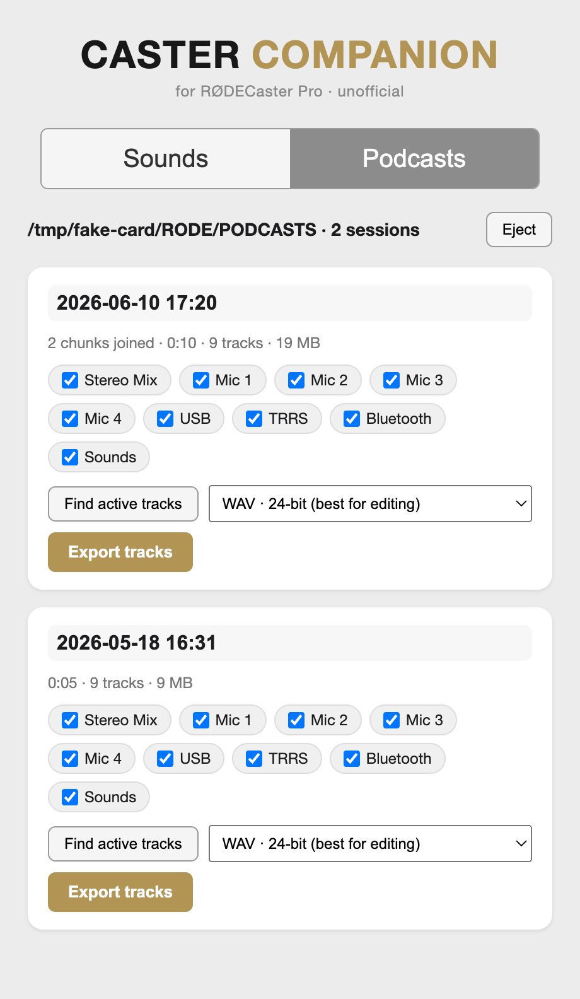

# Caster Companion

**An unofficial, native Apple Silicon companion app for the original RØDECaster Pro.**
It pulls your multitrack recordings off the microSD card and exports them as
separate per-channel files — the thing the discontinued RØDE Companion app did,
rebuilt so it runs without Rosetta.



> **Not affiliated with, authorized, or endorsed by RØDE.** "RØDE" and
> "RØDECaster" are trademarks of their respective owner and are used here only
> to describe what hardware this tool works with. This project contains no RØDE
> code, firmware, or assets.

---

## Quick start — build your own app

There is **no prebuilt download.** You build the app yourself, once, from this
source — then it lives in your Applications folder like any other Mac app and
you never touch the terminal again.

You need an Apple Silicon Mac and [Node.js](https://nodejs.org). Then, in the
downloaded repo folder, pick either:

**Easiest — double-click the installer:** double-click **`install.command`** in
Finder. It builds the app and installs it to your Applications folder.

**Or one terminal command:**

```sh
npm run setup
```

Either way you end up with **Caster Companion** in `/Applications` — launch it
from there or drag it to your Dock. ffmpeg is **bundled inside the app**, so
there's nothing else to install. Details and the run-from-source path are in
[Install & run](#install--run).

---

## Why this exists

RØDE's original RODECaster Pro Companion app (`com.rode.rodecasterpro`) is an
**Intel-only** macOS build. It runs today only through Rosetta 2, and will stop
working when Apple removes Rosetta. RØDE never shipped an Apple Silicon build for
the **first-generation** RODECaster Pro — their newer "RØDECaster App" only
supports the Pro II / Duo / Video / Streamer X.

Caster Companion is a clean-room reimplementation of the parts of that workflow
that actually matter: getting your recordings off the card. It is built on
Electron + ffmpeg and runs natively on `arm64`.

## Features

### Podcasts — multitrack export (done)
- **Auto-detects the card** when you put the device in *Podcast Transfer Mode*
  (it mounts as a `RODECASTER` USB volume). No drivers, no setup.
- **Groups recordings into sessions.** The gen-1 unit splits a long recording
  into multiple `POD#####.WAV` files at the FAT32 4GB limit. Caster Companion
  reads the embedded date tag in each file and groups + re-joins the chunks into
  one continuous recording per session.
- **Exports each input as its own file** — the whole point of multitrack:
  `Stereo Mix`, `Mic 1`–`Mic 4`, `USB`, `TRRS`, `Bluetooth`, `Sounds`.
  Files are named `{your session name} - {track}.{ext}`.
- **Editable session name** (defaults to the recording date) and a **live
  progress bar**, like the original.
- **Find active tracks** — scans the audio and auto-selects only the channels
  that have signal, so you don't export six silent mic tracks.
- **Format choice** the original never gave you:
  - **WAV 24-bit** — lossless master, the default, best for editing.
  - **MP3 / AAC** — selectable bitrate (128–320 kbps) with an optional
    **−16 LUFS** loudness normalization toggle (matching RØDE's Advanced
    Settings) for a ready-to-publish file.

### Sounds — device detection only
Two original-app features rely on RØDE's proprietary USB HID protocol and are
**not** implemented: uploading audio to the sound pads, and toggling Podcast
Transfer Mode from the app (you do that on the device's touchscreen instead).
The Sounds tab detects your connected RØDECaster and shows its USB IDs so you
can confirm it's seen. See [docs/SOUND-PADS.md](docs/SOUND-PADS.md) for the full
status and a concrete path to decoding the HID protocol.

## Safety

Caster Companion is **read-only with respect to your card.** It never writes to
or deletes anything on the SD card — it only reads recordings and writes the
exported files to a destination folder you choose. The **Eject** button just
safely unmounts the card (a standard `diskutil eject`), after which you exit
Transfer Mode on the device. There is no delete or card-write code anywhere in
the project.

## Requirements

- Apple Silicon Mac, macOS 11 or later
- Node.js — only needed to *build* the app or run from source. The finished
  app has no runtime dependencies.

ffmpeg (used for the channel split, chunk join, and format conversion) is
bundled via [`ffmpeg-static`](https://www.npmjs.com/package/ffmpeg-static) and
shipped inside the app. WAV metadata is read directly from the file headers, so
no separate `ffprobe` is needed either.

## Install & run

### Option A — build the standalone app (recommended)

The double-click `install.command`, or `npm run setup`, does this end to end:
fetches dependencies, builds the app, and installs it to `/Applications`. To do
the same steps by hand:

```sh
npm install
npm run build-app      # builds and copies to /Applications
```

(`npm run package` alone just builds into `dist/` without installing.) Because
you build it locally there's no Gatekeeper quarantine, so it opens with a normal
double-click — no terminal needed afterward.

### Option B — run from source (for development)

```sh
npm install
npm start
```

## Notes

- **Self-contained.** ffmpeg is bundled, so the built app needs nothing else
  installed to run. (If a system ffmpeg is somehow preferred for development,
  `src/main.js` falls back to `/opt/homebrew/bin/ffmpeg` only when the bundled
  binary is missing.)
- **No prebuilt binary, by design.** This repo ships source only — everyone
  builds their own copy from it. A locally built app has no Gatekeeper
  quarantine and opens with a normal double-click, so there's no code-signing or
  Apple Developer ID involved. (Signing/notarization only matters for handing
  people a *prebuilt download*, which this project intentionally doesn't do.)
- **ffmpeg licensing.** `ffmpeg-static` ships a GPL build of ffmpeg, included in
  each locally built app. That's fine for personal/source-built use; the bundled
  ffmpeg's source is available from the FFmpeg project.

## How to use it

1. Connect the RØDECaster Pro via USB.
2. On the device's touchscreen, tap the **SD-card icon** and enable
   **Podcast Transfer Mode**. (You don't need this app to do that — it's a
   device function.)
3. Open Caster Companion. Your sessions appear in the **Podcasts** tab.
4. (Optional) Click **Find active tracks** to auto-select only the channels that
   were actually used.
5. Name the session, choose a format, and click **Export tracks**. Pick a
   destination folder; the files are written there and revealed in Finder.

> Big sessions are several GB and take a few minutes to export — the progress
> bar tracks it. WAV is fastest (no encoding); MP3/AAC are slower because each
> track is encoded. Using **Find active tracks** keeps exports quick by only
> processing the tracks that matter.

### Testing without hardware

```sh
RODE_TEST_VOLUME=/path/to/folder-with-POD-wavs npm start
```

## Documentation

- **[docs/PROTOCOL.md](docs/PROTOCOL.md)** — how the RODECaster Pro stores
  recordings: USB IDs, the 14-channel multitrack layout, the session/chunk
  grouping scheme, and how each fact was verified.
- **[docs/ARCHITECTURE.md](docs/ARCHITECTURE.md)** — how the app is built: the
  main/preload/renderer split, the IPC surface, and the ffmpeg filtergraph that
  does the channel split + chunk join in a single pass.
- **[docs/SOUND-PADS.md](docs/SOUND-PADS.md)** — status of the sound-pad upload
  feature and a concrete plan for decoding the HID protocol.

## Support

This app is free and MIT-licensed. If it saved your recordings (or your
RODECaster from retirement), you can
[buy me a coffee](https://buymeacoffee.com/JeffDwoskinShow) ☕

## License

MIT — see [LICENSE](LICENSE).
